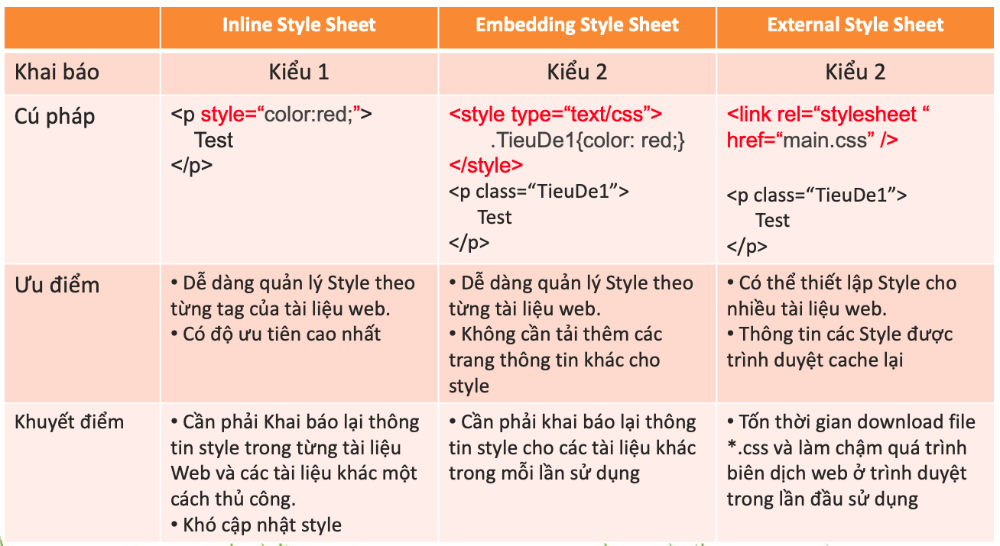
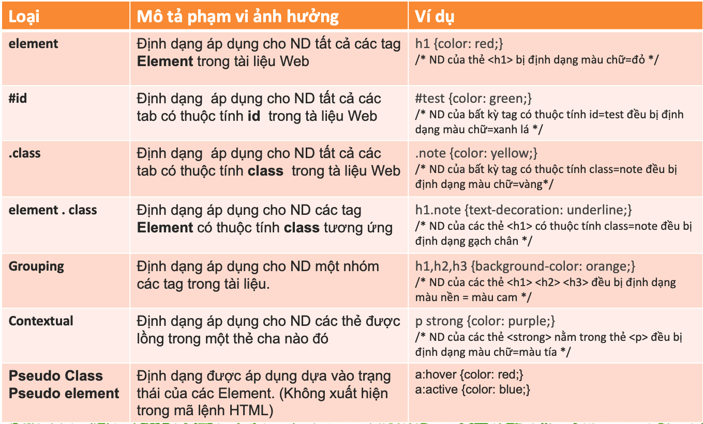
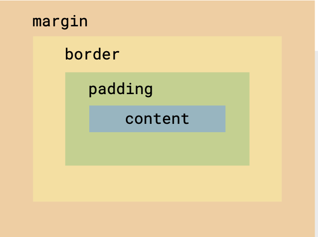
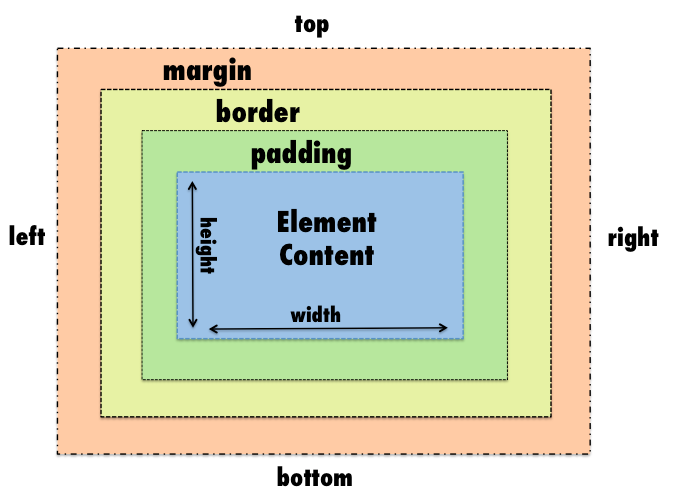

# Cheatsheet CSS

## 1. Cú pháp
```css
selector {
    property1: value1;
    property2: value2;
    property3: value3;
    ...
}
```

- `selector`: Là tên thành phần mà bạn muốn định dạng
- `property`: Thuộc tính css
- `value`: Giá trị của thuộc tính css

Ví dụ: 
```css
h1 {
    color: red; /*Nội dung sẽ có màu đỏ*/
    text-align: center; /*Nội dung sẽ được canh giữa*/
}

.noi-dung-item {
    background: blue; /*Các phần từ thuộc class noi-dung-item sẽ có background màu xanh*/
    margin-top: 10px; /* Các phần từ thuộc class noi-dung-item sẽ cách phần từ ở trên 10px*/
}
```

## 2. Các kiểu viết CSS
#### Tóm tắt


#### 2.1 Kiểu 1 - Inline style (Viết `css` trực tiếp trong thẻ html)
```css
<tagname style="property: value;">
```

Ví dụ:
```css
<div style="color: red;">Hôm nay tôi đi học</div>
```
#### 2.2 Kiểu 2 - Internal style (Viết `css` ở trong thẻ `style` và được đặt trong thẻ `head`)
```html
<head>
    <style>
        selector {property: value;}
    </style>
<head>
```
Ví dụ:
```html
<html lang="en">
<head>
    <title>Document</title>
    <style>
        p {
            color: red;
        }

        #id1 {
            text-align: center;
        }
    </style>
</head>
<body>
    <p>Trời hôm nay thật đẹp!</p>
    <div>Tôi muốn đi leo núi</div>
</body>
</html>
```

#### 2.3 Kiểu 3 - External style (Viết `css` trong file có đuôi `.css` và link vào file html)
```html
<head>
    <link rel="stylesheet" href="./style.css"/>
<head>
```
Ví dụ:

- File style.css
```css
p {
    color: red;
}

#id1 {
    text-align: center;
}
```

- File index.html
```html
<html lang="en">
<head>
    <title>Document</title>
    <link rel="stylesheet" href="./style.css"/>
</head>
<body>
    <p>Trời hôm nay thật đẹp!</p>
    <div>Tôi muốn đi leo núi</div>
</body>
</html>
```

## 3. Selector


## 4. Kích thước của phần tử trong html



## 5. Đơn vị độ dài trong Css
#### 5.1 Độ dài tuyệt đối
|Đơn vị | Mô tả |
|------ |-------|
|cm	    |centimeters
|mm	    |millimeters
|in	    |inches (1in = 96px = 2.54cm)
|px 	|pixels (1px = 1/96th of 1in)
|pt	    |points (1pt = 1/72 of 1in)
|pc	    |picas (1pc = 12 pt)

#### 5.2 Độ dài tương đối

|Đơn vị | Mô tả |
|------ |-------|
|em	    | So với kích thước phông chữ của phần tử -> `2em = 2 lần kích thước phông chữ`	
|vw	    |So với 1% chiều rộng của khung hình -> `10vw = 10% chiều rộng khung hình`	
|vh	    |So với 1% chiều cao của khung hình -> `15vh = 15% chiều cao khung hình`
|%	    |So với phần tử chứa nó (phần tử cha) -> `width = 10% tương đương phần tử sẽ có độ dài bằng 10% phần từ chứa nó`

## 6. Các thuộc tính `CSS` thường dùng

#### Định dạng hiển thị:
- **display**: `none`, `block`, `inline`, `inline-block`, `flex`, `grid`
- **float**: `left`, `right`, `none`
- **clear**: `left`, `right`, `both`, `none`
- **overflow**: `visible`, `hidden`, `scroll`, `auto`
- **visibility**: `visible`, `hidden`, `collapse`

#### Định dạng vị trí:
- **position**: `static`, `relative`, `absolute`, `fixed`, `sticky`
- **top**: `auto`, `<length>` (e.g., `10px`, `50%`)
- **bottom**: `auto`, `<length>`
- **left**: `auto`, `<length>`
- **right**: `auto`, `<length>`
- **z-index**: `<number>` (e.g., `0`, `10`, `100`)

#### Định dạng khoảng cách:
- **margin**: `<length>`, `auto`, `0`
- **margin-top**: `<length>`, `auto`
- **margin-bottom**: `<length>`, `auto`
- **margin-left**: `<length>`, `auto`
- **margin-right**: `<length>`, `auto`
- **padding**: `<length>`, `0`
- **padding-top**: `<length>`, `0`
- **padding-bottom**: `<length>`, `0`
- **padding-left**: `<length>`, `0`
- **padding-right**: `<length>`, `0`

#### Định dạng kích thước:
- **width**: `<length>`, `auto`, `100%`, `vw`, `vh`
- **height**: `<length>`, `auto`, `100%`, `vh`

#### Định dạng khung viền:
- **border**: `<width> <style> <color>` (e.g., `1px solid #000`)
- **border-color**: `<color>` (e.g., `#000`, `red`)
- **border-style**: `none`, `solid`, `dotted`, `dashed`, `double`
- **border-width**: `<length>` (e.g., `1px`, `2px`)
- **border-radius**: `<length>` (e.g., `5px`, `50%` for circular)

#### Định dạng Text:
- **color**: `<color>` (e.g., `#000`, `blue`)
- **font**: `italic bold 16px/30px Arial, sans-serif`
- **font-family**: `Arial`, `Helvetica`, `sans-serif`, `serif`
- **font-size**: `<length>`, `px`, `em`, `rem`
- **font-weight**: `normal`, `bold`, `bolder`, `lighter`, `<number>` (e.g., `400`, `700`)
- **letter-spacing**: `<length>` (e.g., `1px`, `0.1em`)
- **line-height**: `<number>`, `<length>` (e.g., `1.5`, `20px`)
- **text-align**: `left`, `right`, `center`, `justify`
- **text-decoration**: `none`, `underline`, `overline`, `line-through`
- **text-indent**: `<length>` (e.g., `20px`)
- **text-transform**: `none`, `capitalize`, `uppercase`, `lowercase`
- **vertical-align**: `baseline`, `sub`, `super`, `top`, `middle`, `bottom`

#### Định dạng danh sách:
- **list-style**: `<type> <position> <image>` (e.g., `disc inside url("image.png")`)
- **list-style-image**: `url("path/to/image.png")`, `none`
- **list-style-position**: `inside`, `outside`
- **list-style-type**: `disc`, `circle`, `square`, `decimal`, `none`

#### Định dạng Background:
- **background**: `<color> <image> <position> / <size> <repeat> <attachment>`
- **background-attachment**: `scroll`, `fixed`, `local`
- **background-color**: `<color>` (e.g., `#fff`, `blue`)
- **background-image**: `url("path/to/image.jpg")`, `none`
- **background-position**: `left`, `center`, `right`, `<percentage>` (e.g., `50%`), `<length>` (e.g., `10px`)
- **background-repeat**: `repeat`, `repeat-x`, `repeat-y`, `no-repeat`

#### Định dạng con trỏ chuột:
- **cursor**: `default`, `pointer`, `text`, `move`, `not-allowed`, `wait`
