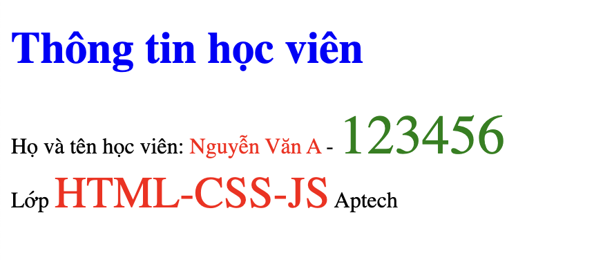
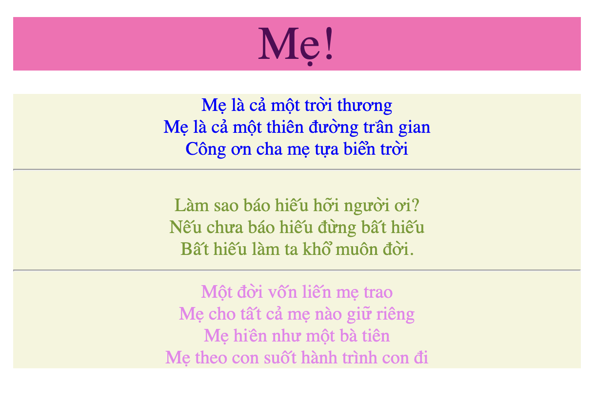
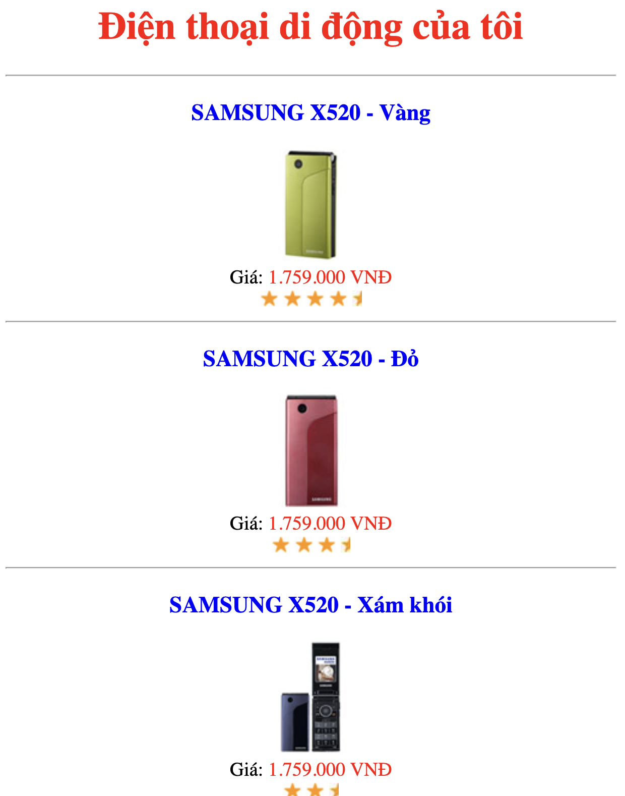

# HTML-CSS-JS@Lab-01

#### Bài 1: Thiết kế trang web với nội dung và định dạng sau

---

# Tầm Quan Trọng của HTML, CSS và JavaScript Trong Phát Triển Web

Khi bắt đầu học về lập trình web, ba thành phần cơ bản và quan trọng nhất mà bất kỳ lập trình viên nào cũng cần hiểu rõ là **HTML**, **CSS**, và **JavaScript**. Đây là bộ ba ngôn ngữ cốt lõi trong thiết kế và phát triển trang web, giúp xây dựng giao diện và tương tác người dùng hiệu quả. Dưới đây là vai trò cụ thể của từng thành phần.

## 1. HTML (Hypertext Markup Language)

HTML là viết tắt của **Hypertext Markup Language**, ngôn ngữ đánh dấu dùng để tạo nên cấu trúc và nội dung của trang web. HTML đóng vai trò như là "bộ xương" của trang web, nơi bạn xác định bố cục các phần tử như văn bản, hình ảnh, liên kết, và nhiều nội dung khác.

### Tại sao HTML quan trọng?

- **Tạo cấu trúc cơ bản cho trang web**: HTML giúp tổ chức nội dung theo bố cục hợp lý, với các thẻ như `<header>`, `<footer>`, `<section>`, và `<article>`.
- **Hiển thị nội dung**: Văn bản, hình ảnh, video và các thành phần khác của trang đều được hiển thị nhờ HTML.
- **SEO (Tối ưu công cụ tìm kiếm)**: HTML giúp cho các công cụ tìm kiếm như Google dễ dàng đọc và hiểu cấu trúc của trang web, góp phần tối ưu hóa SEO.

## 2. CSS (Cascading Style Sheets)

CSS, hay **Cascading Style Sheets**, là ngôn ngữ dùng để mô tả cách các thành phần HTML sẽ hiển thị trên trang web. CSS giống như "lớp da" của trang web, mang lại phong cách và sự thẩm mỹ.

### Lợi ích của CSS

- **Thiết kế giao diện**: CSS giúp tùy chỉnh màu sắc, font chữ, bố cục và phong cách hiển thị, tạo nên giao diện hài hòa và thu hút.
- **Tăng tính nhất quán và dễ quản lý**: CSS giúp việc định dạng giao diện cho nhiều trang trở nên dễ dàng và nhất quán.
- **Hỗ trợ thiết kế responsive**: CSS với các phương pháp như Flexbox, Grid, và Media Query giúp trang web hiển thị tốt trên mọi thiết bị, từ máy tính để bàn đến điện thoại di động.

## 3. JavaScript (JS)

JavaScript là ngôn ngữ lập trình giúp thêm tính năng động và tương tác vào trang web. JavaScript đóng vai trò như "bộ não" của trang web, cho phép thực hiện các thao tác phức tạp và xử lý các sự kiện người dùng.

### Tầm quan trọng của JavaScript

- **Tăng cường tính tương tác**: JavaScript giúp trang web phản hồi nhanh chóng theo hành động của người dùng, như nhấp chuột, di chuyển chuột và nhập liệu.
- **Phát triển ứng dụng web hiện đại**: Với các thư viện và framework như React, Angular và Vue, JavaScript hỗ trợ xây dựng các ứng dụng web phức tạp và mạnh mẽ.
- **Xử lý dữ liệu**: JavaScript cho phép xử lý và thao tác dữ liệu ngay trên trình duyệt mà không cần phải gửi yêu cầu lên server.

## Tổng Kết

Bộ ba HTML, CSS và JavaScript không chỉ là nền tảng cho việc phát triển web mà còn là:

- **Công cụ cơ bản** giúp xây dựng và phát triển giao diện người dùng (UI) và trải nghiệm người dùng (UX).
- **Cơ sở để học các công nghệ và framework nâng cao**: Để thành thạo các công nghệ mới hơn như React, Angular, hoặc các kỹ thuật tối ưu hóa web, hiểu vững HTML, CSS và JavaScript là điều không thể thiếu.
- **Thúc đẩy sáng tạo và khả năng phát triển cá nhân** trong lĩnh vực lập trình web.

### So sánh tóm tắt HTML, CSS và JavaScript

| Ngôn ngữ    | Chức năng chính                                        | Ví dụ về sử dụng                               |
|-------------|--------------------------------------------------------|-----------------------------------------------|
| HTML        | Xây dựng cấu trúc và nội dung cho trang web            | `<header>`, `<footer>`, `
`, ``       |
| CSS         | Thiết lập phong cách và trình bày cho các phần tử      | `color: red; font-size: 16px; display: flex;`|
| JavaScript  | Thêm tính năng động và tương tác vào trang web         | `document.getElementById("demo").innerHTML = "Hello World!";`|

Với nền tảng HTML, CSS và JavaScript vững chắc, bạn đã sẵn sàng để khám phá sâu hơn về phát triển web và thực hiện các dự án ấn tượng.

---

#### Bài 2: Xây dựng trang web với nội dung sau

Gợi ý:
    - Sử dụng thẻ `div`, `span`
    - Sử dụng thuộc tính `style`

#### Bài 3: Xây dựng trang web với nội dung sau

Gợi ý:
    - Sử dụng thẻ `div`
    - Sử dụng thuộc tính `style`
    - Sử dụng `margin` và `padding`

#### Bài 4: Xây dựng trang web với nội dung sau
[Link ảnh](https://drive.google.com/drive/u/0/folders/1PKjbJFNkKGJa0IPhQgPUwgFyndzp9SFk)

#### Bài 5: Xây dựng trang web với nội dung sau
[Link ảnh](https://drive.google.com/drive/u/0/folders/1vCdajXqxpAx-3-bGsQIqe7RTEcKI-7yw)

