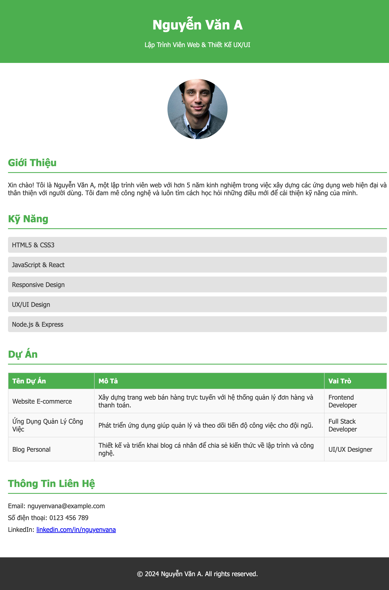

# HTML-CSS-JS@Lab-02

#### Bài 1: Thiết kế trang web với nội dung và định dạng sau

#### Bài 2: Thiết kế trang web với nội dung và định dạng sau

#### Bài 3: Thiết kế trang web với nội dung và định dạng sau
