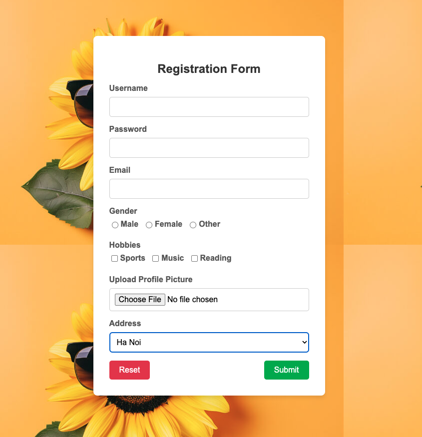

# HTML-CSS-JS@Lab-03

## A. Animation

#### 1. Giới Thiệu Về Animation CSS
CSS Animation là một kỹ thuật dùng để tạo các hiệu ứng chuyển động mượt mà mà không cần JavaScript. CSS hỗ trợ hai loại animation chính:
- `transition`: Thay đổi trạng thái của các thuộc tính CSS theo thời gian khi có một sự kiện kích hoạt.
- `@keyframes`: Cho phép tạo các khung hình hoạt hình (animation frames) phức tạp hơn.

#### 2. Transition
Transition đơn giản hóa việc thay đổi thuộc tính CSS một cách mượt mà.
**Cấu trúc cơ bản của transition:**
```css
transition: property duration timing-function delay|initial|inherit;
```

**Hoặc sử dụng các thuộc tính tường minh bên dưới:**
- `transition-property`: Thuộc tính muốn thay đổi (như `width`, `height`, `opacity`, etc.).
- `transition-duration`: Thời gian chuyển động (tính bằng giây hoặc mili giây).
- `transition-timing-function`: Quy luật tốc độ của chuyển động (linear, ease, ease-in, ease-out, ease-in-out).
- `transition-delay`: Thời gian trễ trước khi animation bắt đầu.


**Ví dụ**:
```css
.box {
    width: 100px;
    height: 100px;
    background-color: red;
    /* transition: width 2s ease-in-out 1s; */
    transition-property: width;
    transition-duration: 2s;
    transition-timing-function: ease-in-out;
    transition-delay: 1s;
}

.box:hover {
    width: 200px;
}
```

#### 3. Keyframes và Animation
```css
Hiệu ứng animation = Định nghĩa keyframes + thuộc tính animation
```
##### 3.1 Keyframes
Keyframes cho phép tạo các animation phức tạp bằng cách định nghĩa từng giai đoạn của animation.
**Cấu trúc cơ bản của keyframe:**
```css
@keyframes name {
  keyframes-selector {css-styles;}
  keyframes-selector {css-styles;}
  ...
}
```
`keyframes-selector`: Các giai đoạn của hiệu ứng
- 0-100%
- from (Giống như 0%)
- to (Giống như 100%)

`css-styles`: Thuộc tính css

Ví dụ:
```css
@keyframes mymove {
  0%   {top: 0px; background: red; width: 100px;}
  100% {top: 200px; background: yellow; width: 300px;}
}

@keyframes mymove2 {
  from {top: 0px; background: red; width: 100px;}
  to {top: 200px; background: yellow; width: 300px;}
}
```

##### 3.1 Thuộc tính animation
Animation là thuộc tính css giúp thể hiện các hiệu ứng animation
**Cấu trúc cơ bản của thuộc tính animation:**
```css
animation: name duration timing-function delay iteration-count direction fill-mode play-state;
```

**Hoặc sử dụng các thuộc tính tường minh bên dưới:**
- `animation-name`: Tên của keyframe animation.
- `animation-duration`: Thời gian chạy animation.
- `animation-delay`: Thời gian trễ trước khi animation bắt đầu.
- `animation-timing-function`:  Quy luật tốc độ của chuyển động.
- `animation-iteration-count`: Số lần lặp của animation (ví dụ `infinite` để lặp vô hạn).
- `animation-direction`: Hướng của animation (`normal`, `reverse`, `alternate`, `alternate-reverse`).
- `animation-fill-mode`: Xác định cách giữ trạng thái của animation (`none`, `forwards`, `backwards`, `both`).
- `animation-play-state`: Dừng hoặc phát animation (`running` hoặc `paused`).

**Ví dụ**:
```css
@keyframes example {
    0% { background-color: red; left: 0; }
    50% { background-color: yellow; left: 100px; }
    100% { background-color: blue; left: 200px; }
}

.box {
    position: relative;
    width: 100px;
    height: 100px;
    background-color: red;
    /* animation: example 5s infinite; */
    animation-name: example;
    animation-duration: 5s;
    animation-iteration-count: infinite;
}
```

---

## Bài Tập CSS Animation (Kèm Lời Giải)

#### Bài 1: Tạo Animation Hover Cho Kích Thước
**Bài Tập**: Tạo một ô vuông có hiệu ứng phóng to khi hover.
**Lời Giải**:
```css
.box {
    width: 100px;
    height: 100px;
    background-color: blue;
    transition: transform 0.3s ease-in-out;
}

.box:hover {
    transform: scale(1.2);
}
```

#### Bài 2: Tạo Animation Với @keyframes Cho Chuyển Động Sang Phải
**Bài Tập**: Tạo animation di chuyển một phần tử từ trái sang phải.
**Lời Giải**:
```css
@keyframes slideRight {
    from { transform: translateX(0); }
    to { transform: translateX(200px); }
}

.box {
    width: 50px;
    height: 50px;
    background-color: green;
    animation: slideRight 2s ease-in-out;
}
```

#### Bài 3: Tạo Hiệu Ứng Chớp Sáng
**Bài Tập**: Tạo hiệu ứng chớp sáng trên văn bản.
**Lời Giải**:
```css
@keyframes flash {
    0%, 100% { opacity: 1; }
    50% { opacity: 0; }
}

.text {
    font-size: 20px;
    color: red;
    animation: flash 1s infinite;
}
```

#### Bài 4: Tạo Animation Lặp Lại Vô Hạn Cho Màu Nền
**Bài Tập**: Tạo hiệu ứng đổi màu nền liên tục.
**Lời Giải**:
```css
@keyframes colorChange {
    0% { background-color: red; }
    50% { background-color: yellow; }
    100% { background-color: green; }
}

.box {
    width: 100px;
    height: 100px;
    animation: colorChange 3s infinite;
}
```

#### Bài 5: Tạo Animation Bounce (Nảy)
**Bài Tập**: Tạo hiệu ứng nảy cho một phần tử.
**Lời Giải**:
```css
@keyframes bounce {
    0%, 100% { transform: translateY(0); }
    50% { transform: translateY(-30px); }
}

.box {
    width: 50px;
    height: 50px;
    background-color: orange;
    animation: bounce 1s infinite;
}
```

#### Bài 6: Tạo Hiệu Ứng Xoay
**Bài Tập**: Tạo hiệu ứng xoay một phần tử 360 độ.
**Lời Giải**:
```css
@keyframes rotate {
    from { transform: rotate(0deg); }
    to { transform: rotate(360deg); }
}

.box {
    width: 100px;
    height: 100px;
    background-color: purple;
    animation: rotate 2s linear infinite;
}
```

#### Bài 7: Hiệu Ứng Fade In
**Bài Tập**: Tạo hiệu ứng mờ -> xuất hiện.
**Lời Giải**:
```css
@keyframes fadeIn {
    from { opacity: 0; }
    to { opacity: 1; }
}

.box {
    width: 100px;
    height: 100px;
    background-color: black;
    animation: fadeIn 1s ease-in;
}
```

#### Bài 8: Hiệu Ứng Fade Out
**Bài Tập**: Tạo hiệu ứng Xuất hiện -> Mờ -> Ẩn.
**Lời Giải**: Tương tự bài 7

#### Bài 9: Tạo Hiệu Ứng Quay Ngược
**Bài Tập**: Tạo một phần tử quay ngược lại khi đạt giới hạn.
**Lời Giải**:
```css
@keyframes rotateReverse {
    0% { transform: rotate(0deg); }
    50% { transform: rotate(180deg); }
    100% { transform: rotate(0deg); }
}

.box {
    width: 100px;
    height: 100px;
    background-color: cyan;
    animation: rotateReverse 3s ease-in-out infinite;
}
```

#### Bài 10: Tạo Hiệu Ứng Phóng To Thu Nhỏ
**Bài Tập**: Tạo hiệu ứng phóng to, sau đó thu nhỏ trở lại.
**Lời Giải**:
```css
@keyframes zoomInOut {
    0%, 100% { transform: scale(1); }
    50% { transform: scale(1.5); }
}

.box {
    width: 80px;
    height: 80px;
    background-color: pink;
    animation: zoomInOut 2s infinite;
}
```

#### Bài 11: Hiệu Ứng Trượt Trên Dưới
**Bài Tập**: Tạo hiệu ứng trượt lên xuống cho phần tử.
**Lời Giải**:
```css
@keyframes slideUpDown {
    0% { transform: translateY(0); }
    50% { transform: translateY(50px); }
    100% { transform: translateY(0); }
}

.box {
    width: 50px;
    height: 50px;
    background-color: teal;
    animation: slideUpDown 1.5s ease-in-out infinite;
}
```

---


## B. Form

#### Bài 1: Thiết kế trang web với nội dung sau


**Yêu cầu:**
1. Bấm nút `Reset` thì sẽ reset toàn bộ nội dung trong form
1. Field `Password` luôn phải có dữ liệu thì mới bấm `Submit` được
1. Bấm vào nút `Submit` sẽ gửi nội dung đến page bài 3 của lab02 theo phương thức `POST`
1. Bấm vào nút `Submit` sẽ gửi nội dung đến page bài 3 của lab02 theo phương thức `GET`