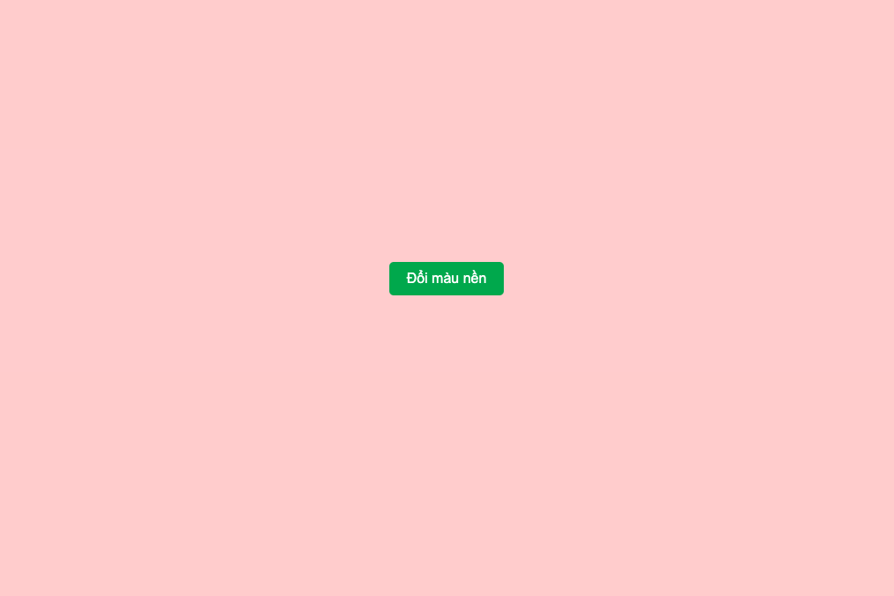
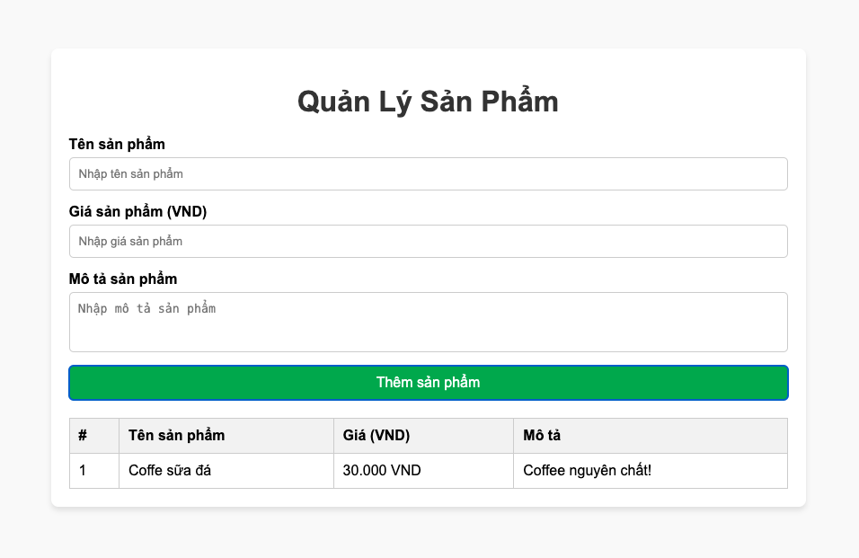

# HTML-CSS-JS@Lab-05

#### Bài 1: Thiết kế trang web với các yêu cầu sau
**Mô tả:** Khi người dùng nhấn vào nút, một hộp thông báo xuất hiện ở giữa màn hình với hiệu ứng mờ nền.

**Giao diện:**
- Trước khi bấm nút

- Sau khi bấm nút


#### Bài 2: Thiết kế trang web với các yêu cầu sau
**Mô tả:** Khi nhấn nút, màu nền sẽ đổi ngẫu nhiên với hiệu ứng mờ dần.

**Giao diện:**
- Trước khi bấm nút

- Sau khi bấm nút



#### Bài 3: Thiết kế trang web với các yêu cầu sau
**Mô tả:** Khi nhấn nút tăng giảm kích thước thì kích thước chữ sẽ được tăng giảm

**Giao diện:**
- Trước khi bấm nút

- Sau khi bấm nút `Tăng kích thước`

- Sau khi bấm nút `Giảm kích thước`


#### Bài 4: Thiết kế trang web với các yêu cầu sau
**Mô tả:**  Tạo một thanh trượt ảnh. Khi nhấn vào nút "Tiếp" hoặc "Trước", ảnh sẽ thay đổi.
Link ảnh:
```css
https://images.unsplash.com/photo-1509042239860-f550ce710b93
https://images.unsplash.com/photo-1512568400610-62da28bc8a13
https://images.unsplash.com/photo-1511920170033-f8396924c348
```

**Giao diện:**
- Trước khi bấm nút

- Sau khi bấm nút `Trước`

- Sau khi bấm nút `Sau`


#### Bài 5: Thiết kế trang web với các yêu cầu sau
**Mô tả:**  Tạo một ứng dụng trắc nghiệm nhỏ, hiển thị câu hỏi và chấm điểm người dùng sau khi họ chọn đáp án.

**Giao diện:**
- Trước khi bấm nút `Nộp Bài`

- Sau khi chọn sai và bấm nút `Nộp Bài`

- Sau khi chọn đúng và bấm nút `Nộp Bài`


#### Bài 6: Thiết kế trang web với các yêu cầu sau
**Giao diện:**


**Yêu cầu**
- Khi `hover` vào text field thì border sẽ là màu đỏ
- Khi `focus` vào text field thì background sẽ là màu hồng, chữ sẽ có màu xanh


- Thay đổi ngôn ngữ hiển thị theo ngôn ngữ được chọn trên form


- Kiểm tra dữ liệu đầu vào phải thoả các điều kiện sau mới cho phép đăng nhập nếu không phải thông báo lỗi:
    + Tên đăng nhập: Không được để trống và có độ dài tối đa 20 kí tự
    + Mật khẩu: Không được để trống, có độ dài tối thiểu 6 kí tự, phải có chữ và số

#### Bài 7: Thiết kế trang web với các yêu cầu sau
**Mô tả:** Người dùng nhập điểm các môn học và nhấn nút tính toán. Ứng dụng sẽ hiển thị kết quả điểm trung bình và đánh giá học lực.
- 9 <= Điểm trung bình <= 10 : Học lực Xuất sắc 
- 8 <= Điểm trung bình < 9 : Học lực Giỏi 
- 6,5 <= Điểm trung bình < 8 : Học lực Khá 
- 5 <= Điểm trung bình < 6,5 : Học lực Trung bình 
- Điểm trung bình < 5 : Học lực Yếu 

**Giao diện:**
- Trước khi bấm nút `Tính trung bình`


- Sau khi bấm nút `Tính trung bình`


#### Bài 8: Thiết kế trang web với các yêu cầu sau
**Mô tả:**  Tạo một ứng dụng cho phép người dùng thêm sản phẩm vào danh sách và hiển thị danh sách sản phẩm theo bảng.

**Giao diện:**
- Trước khi bấm nút `Thêm sản phẩm`

- Sau khi bấm nút `Thêm sản phẩm`


#### Bài 9: Thiết kế trang web với các yêu cầu sau
**Mô tả:** Thêm tính năng `sửa` và `xoá` sản phẩm trong `bài 8`

**Giao diện:**
- Trước khi bấm nút `Thêm sản phẩm`

- Sau khi bấm nút `Sửa`: Thông tin sản phẩm sẽ được load lên form, nút `Thêm sản phẩm` đổi thành `Cập nhật sản phẩm`

- Khi bấm nút `Xoá` thì dữ liệu sẽ mất
